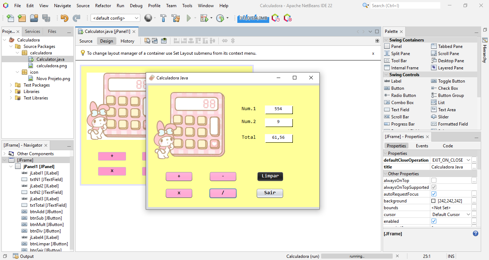

# Calculadora Java

Calculadora desktop desenvolvida em **Java** utilizando **Java Swing** para criação da interface gráfica.

O projeto foi desenvolvido como prática dos conceitos de programação orientada a objetos, criação de interfaces gráficas e tratamento de eventos em Java.

## Funcionalidades

- ➕ Adição
- ➖ Subtração
- ✖️ Multiplicação
- ➗ Divisão
- ⚠️ Tratamento de divisão por zero
- 🔢 Exibição de resultados com duas casas decimais

## Tecnologias utilizadas

- Java
- Java Swing
- NetBeans IDE
- Git e GitHub

## Demonstração



## ▶️ Como executar

1. Clone este repositório:

```bash
git clone https://github.com/mandyreadings/calculadora-java.git
```

2. Abra o projeto no **NetBeans IDE**.

3. Execute o arquivo principal da aplicação:

`src/calculadora/Calculadora.java`

4. Clique em **Run Project** ou pressione **F6** para iniciar a aplicação.
